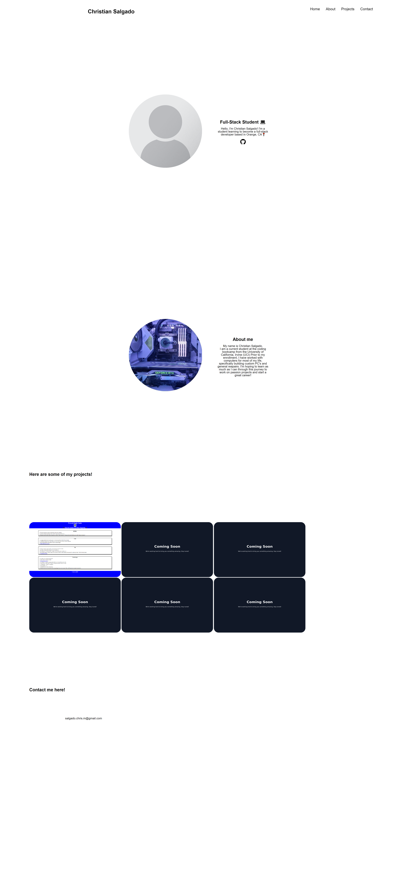

# CS-Portfolio

## Description

- My first iteration of my portfolio! This portfolio only includes HTML and CSS for now. As I learn new code and styling I'll be sure to update this page as I see fit!

## Usage

- On the top right of the Nav bar you can click on a subject and It'll scrol for you to that section on the webpage!

- Included on the bottom of the webpage is my email address for you to contact me!

Launched webstie link: https://crissal2.github.io/CS-Portfolio/

